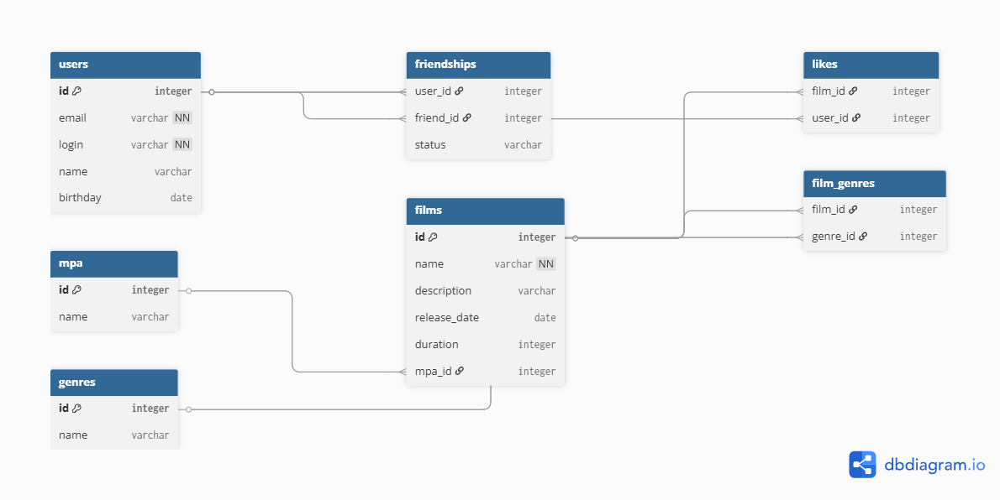

## Схема базы данных



## Примеры SQL-запросов

**Все фильмы:**
```sql
SELECT f.*, m.name AS mpa_name
FROM films f
JOIN mpa m ON f.mpa_id = m.id;
```

**Все пользователи:**
```sql
SELECT * FROM users;
```

**Топ N популярных фильмов:**
```sql
SELECT f.*, COUNT(l.user_id) AS likes_count
FROM films f
LEFT JOIN likes l ON f.id = l.film_id
GROUP BY f.id
ORDER BY likes_count DESC
LIMIT N;
```

**Общие друзья двух пользователей:**
```sql
SELECT u.*
FROM users u
WHERE u.id IN (
    SELECT friend_id FROM friendships WHERE user_id = ?
)
AND u.id IN (
    SELECT friend_id FROM friendships WHERE user_id = ?
);
```